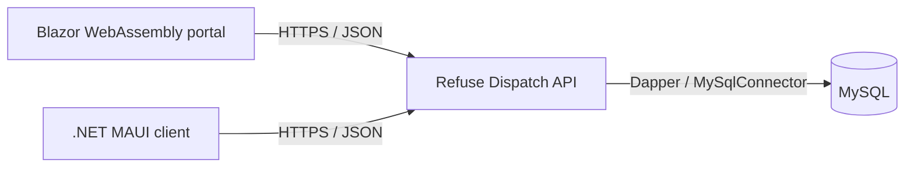

# Refuse Dispatch Management Portal

> **Status:** Portfolio prototype. The dashboard behavior is implemented, but it depends on the companion API, whose security and isolated-demo work must be completed before this project is suitable for operational data or a public demonstration.

This Blazor WebAssembly dashboard presents current fleet activity and historical dispatch records. It is the browser-based management client in a three-part dispatch system: the portal reads JSON from an ASP.NET Core API, and the API owns database access.

## Implemented dashboard behavior

- Loads trucks, employees, and dispatch records from the API during page initialization.
- Shows fleet proportions for available, dispatched, and maintenance-marked trucks in a MudBlazor donut chart.
- Lists the current day's dispatched trucks with service area, route, and refuse type.
- Builds a distinct list of dispatch dates and opens a filtered record view for a selected date.
- Resolves stored employee identifiers to driver and helper names in the historical view.

The current interface is implemented in [Views/Home.razor](./Views/Home.razor). It does not include authentication, a resilient loading/error experience, or automated UI tests.

## Architecture



- **Framework:** .NET 8 Blazor WebAssembly
- **UI:** MudBlazor 7.8.0
- **API client:** <code>HttpClient</code> wrapper in [Service/APIConnection.cs](./Service/APIConnection.cs)
- **Project:** [RefuseManagementPortal.csproj](./RefuseManagementPortal.csproj)

The API address is currently fixed in <code>APIConnection.cs</code>; there is no environment-based runtime setting in this version. Starting the portal therefore attempts to contact the configured remote service. Replace that dependency with an isolated, fictional-data API before demonstrating the application.

## Build and verification

With the .NET 8 SDK installed, the client can be compiled without contacting the API:

```powershell
dotnet restore .\RefuseManagementPortal.csproj
dotnet build .\RefuseManagementPortal.csproj
```

A fresh build and browser run were not performed as part of the documentation audit. Runtime behavior still needs to be verified against an isolated API, including empty responses, network failures, missing employee records, and a zero-truck fleet.

## Deployment configuration

The repository includes an [Azure Static Web Apps workflow](./.github/workflows/azure-static-web-apps-mango-beach-0c875520f.yml) for pushes and pull requests targeting <code>master</code>. Its presence documents an intended deployment path; it is not evidence that a current deployment is healthy. Pull requests can also create preview deployments, which should be considered before publishing documentation branches.

## Related components

- [Refuse Dispatch API](https://github.com/mf0zz13/RefuseServiceAPI) — ASP.NET Core backend and database boundary
- [Refuse Dispatch Mobile Client](https://github.com/mf0zz13/RefuseServiceApp) — .NET MAUI Blazor Hybrid dispatch form
- [Gunther Refuse Service](https://github.com/mf0zz13/Gunther_Refuse_Service) — earlier direct-database prototype
